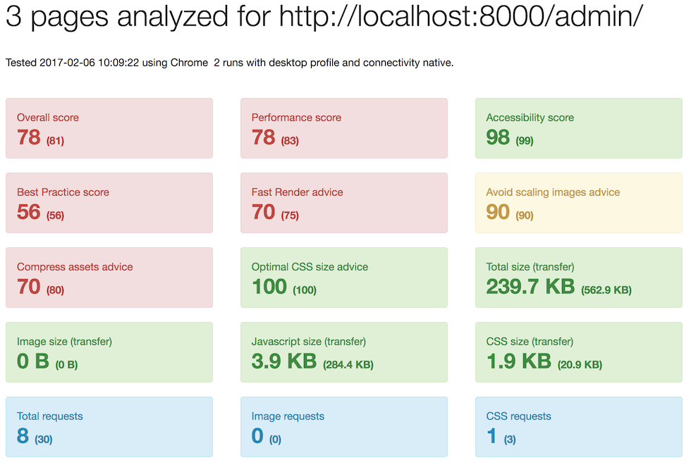

# wagtail-dev-tooling

> Advanced tooling for [Wagtail](https://github.com/wagtail/wagtail) development. See [example reports](https://thibaudcolas.github.io/wagtail-dev-tooling/).

*Check out [Awesome Wagtail](https://github.com/springload/awesome-wagtail) for more awesome packages and resources from the Wagtail community.*

## Installation

```sh
# Get the code from the repository.
git clone git@github.com:thibaudcolas/wagtail-dev-tooling.git
cd wagtail-dev-tooling
# Install dependencies.
nvm install
npm install
# Configure environment variables.
# touch .env
# Configure Wagtail user session ID to use.
# Get this value by logging into the Wagtail admin of your site, then
# use the developer tools to insect the cookies, to find "sessionid".
# echo "WAGTAIL_SESSIONID=yoursessionid" >> .env
```

## UI regression tests

```sh
# 1. Create UI regression reference.
npm run regression:reference
# 2. Run UI regression tests.
npm run regression:test
# 3. Open UI regression report.
npm run regression:open
```

## Web performance audits

```sh
# 1. Start the containers with graphite and grafana.
docker-compose up -d
# 2. Run the performance tests.
npm run performance:test
# 3. Open UI performance report.
npm run performance:open
# 4. Tear down the containers when you've had enough.
docker-compose stop
```

## Git hooks

Pre-commit hook to add within Wagtail at `.git/hooks/pre-commit`:

```sh
#!/usr/bin/env bash

command_exists () {
    type "$1" &> /dev/null ;
}

# Fail on first line that fails.
set -e

# Check if this is the initial commit
if git rev-parse --verify HEAD >/dev/null 2>&1
then
    against=HEAD
else
    against=4b825dc642cb6eb9a060e54bf8d69288fbee4904
fi

# Use git diff-index to check for whitespace errors
if ! git diff-index --check --cached $against
then
    echo "Aborting commit due to whitespace errors."
    exit 1
fi

STAGED=$(git --no-pager diff --name-only --cached --diff-filter=ACM)
JS_STAGED=$(grep .js$ <<< "$STAGED" || true)
SCSS_STAGED=$(grep .scss$ <<< "$STAGED" || true)
PY_STAGED=$(grep .py$ <<< "$STAGED" || true)

if [ -n "$JS_STAGED" ];
then
    ./node_modules/.bin/eslint $JS_STAGED
fi

if [ -n "$SCSS_STAGED" ];
then
    ./node_modules/.bin/stylelint $SCSS_STAGED
fi

if [ -n "$PY_STAGED" ];
then
    if command_exists flake8;
    then
        flake8 $PY_STAGED
    else
        printf "\`flake8\` is missing. The following Python files couldn't be linted:\n$PY_STAGED\n\nMake sure to install the correct Python version as defined in \`.python-version\` and the linting dependencies \`pip install -r requirements/lint.txt\`."
        exit 1
    fi
fi

if [ -n "$JS_STAGED" ];
then
    npm run test:unit:coverage --silent
fi
```

## Examples

### BackstopJS UI regression report


### Grafana dashboard displaying web performance metrics


### Sitespeed performance budget output


### Sitespeed performance metrics



### Sitespeed page load waterfall chart


## Documentation

- https://github.com/garris/BackstopJS
- http://docs.casperjs.org/en/latest/
- http://phantomjs.org/api/webpage/
- https://docs.slimerjs.org/current/api/webpage.html
- https://www.sitespeed.io/
- http://docs.grafana.org/
- https://docs.docker.com/
